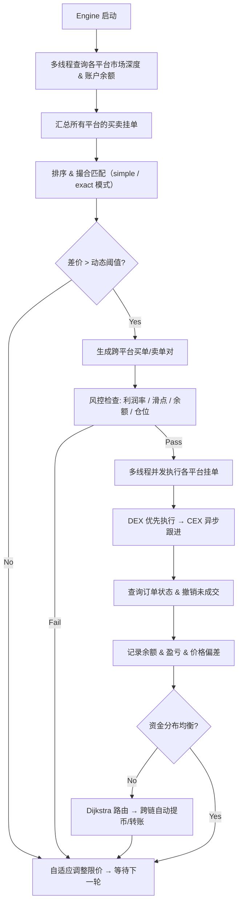

# 🔀 Crypto Cross-Exchange Arbitrage Engine

> **跨平台加密货币套利系统** — 自动捕捉 CEX 与 DEX 之间的价差，支持现货搬砖、合约-现货对冲、链上 DEX 套利，内置跨链资金自动调拨。

[🇬🇧 English](README_en.md)

---

## 📌 项目简介

本系统是一套**全自动加密货币跨平台套利引擎**，核心功能是在多个交易所之间实时发现价差并自动执行买卖，从中赚取差价利润。支持 CEX（Binance、OKX、Bitfinex、Huobi 等）与 DEX（Uniswap），覆盖**现货搬砖**、**合约-现货对冲套利**、**DEX 链上套利**三大策略，并内置**跨链资金自动调拨**系统。

---

## 💎 核心竞争优势

> 与 Hummingbot、Blackbird 等开源套利方案相比，本系统具备以下差异化能力：

### 1. 自适应限价调整系统

不同于固定阈值的套利机器人，本系统内置**三策略动态限价引擎**（`ChangeLimit`），能根据市场状态自动调节各平台间的触发阈值：

- **追高策略** — 突然出现高价差时，自动上调限价追高卖出，20 分钟后智能回调
- **渐进调低策略** — 长期出现小幅差价但达不到阈值时，逐步降低限价，避免资金闲置
- **缺货反向策略** — 当某平台长期无货可卖时，自动将反向限价设为负值，利用价格偏差实现持续套利

所有阈值调整**运行时热更新**，无需重启引擎，配置持久化到 XML 文件。

### 2. 合约-现货混合套利

不仅支持现货搬砖，还支持**合约与现货之间的对冲套利**：

- 支持币本位合约和 USDT 本位合约
- 自动识别多空方向，智能处理开仓、平仓、反转
- 仓位控制：通过 `positionRate` 参数控制最大仓位比例，防止过度杠杆
- 当现货端与合约端出现价差时，自动在两端同时操作锁定利润

### 3. DEX Gas 价格动态优化

针对 Uniswap 等 DEX 的链上交易特性，实现了精细的 Gas 优化策略：

- 实时查询链上 Gas 价格，动态调整出价
- 支持乐观 / 中性 / 悲观三种 Gas 策略（可配置系数）
- 将矿工费精确纳入利润核算（`fixFee`），确保扣除 Gas 后仍有利润
- 自动选择 Uniswap V3 最优费率池（100 / 500 / 3000 / 10000 bps）
- DEX 与 CEX 异步执行策略：DEX 先执行，成功后通过余额调平间接执行 CEX，降低踏空率

### 4. 引擎自愈与无人值守

- 异常退出后自动等待指定时间，然后重建引擎重试
- 每 24 小时自动销毁并重建引擎实例，防止内存泄漏和状态累积
- `EngineThread` 守护线程持续监控，确保 7×24 不间断运行

### 5. 价格偏差走势分析

- 每分钟记录各平台价格与全平台均价的偏差，存入 SQLite
- 生成多平台偏差走势曲线，辅助判断套利时机和平台定价异常
- 支持自定义时间粒度和展示范围

### 6. 跨链资金自动调拨（Dijkstra 路由算法）

这是本系统最独特的能力之一。当资金在多个平台之间分布不均时，系统能**自动提币、跨链转账、智能路由**，将资金调拨到需要的平台：

- **Dijkstra 最短路径路由** — 将各交易所建模为图节点，共享区块链网络为边，使用 Dijkstra 算法自动寻找最优转账路径
- **多跳路由** — 当两个平台没有共同网络时，自动寻找中转平台（如 Binance → OKX → Uniswap），实现跨链间接转账
- **7+ 链网络支持** — Arbitrum、Optimism、Polygon、Avalanche、zkSync、OKTC、TRC20 等
- **ETH/WETH 自动 Wrap** — 转账过程中自动处理 ETH 与 WETH 的转换
- **可配置网络过滤** — 支持 `netWorkContain` / `netWorkNotContain` 精确匹配网络名称
- **异步并行调拨** — 多组转账通过 `CompletableFuture` 并行执行，超时自动等待（最长 10 分钟）

### 7. 智能资金分布策略

- **DEX 集中资金模式** — 通过 `tokenAllInDex` 配置，平时将资金全部存放在 DEX，CEX 不存储资金；等 DEX 交易成功后，再自动将所得资金转入 CEX，资金利用率翻倍
- **虚拟平台冲正（原创设计）** — 跨平台套利中，经常出现只有单边平台交易成功的情况（API 超时、余额不足、网络抖动等），导致该平台的货物/资金偏移，需要立即冲正（回退）。`VirtualTrade` 虚构出一个不存在的"交易所"，注入撮合引擎。当检测到总货物量偏移时，虚拟平台挂出人工价差（如货物多了就挂低价卖单），诱使撮合引擎在其他真实平台上反向交易，自动完成冲正。**整个过程完全复用现有撮合引擎，无需编写任何额外的冲正逻辑**
- **Goods/Money 比例控制** — 通过 `goodsRate` 参数控制货物价值占总资产的比例，自动买卖调节
- **偏移触发阈值** — 通过 `whenBalance` 参数设定任意平台资金偏移多少才触发转账，避免频繁小额转账

---

## ⚡ 核心能力

- 🔄 **多平台价差实时捕捉** — 同时监控多个交易所的市场深度，自动发现套利机会
- ⚡ **高并发撮合引擎** — 基于 `ThreadPoolExecutor` + `CompletableFuture` 的多线程架构，各平台查询与执行并行处理
- 🏦 **CEX + DEX 混合套利** — 同时支持中心化与去中心化交易所，包括 Uniswap 等链上 DEX
- 📊 **两种撮合模式** — 简单匹配（simple）与精细匹配（exact），后者穷举所有平台组合寻找最优价差
- 💰 **双模式盈利** — 可配置"赚币模式"或"赚钱模式"，系统据此采用不同的余额平衡策略
- 🔀 **智能订单合并** — 自动将多个小额订单合并为大单执行，减少 API 调用次数，提高成交率
- 📡 **实时日志推送** — 通过 WebSocket 将交易日志、差价信息实时推送到 Web 前端
- 🛡️ **风控机制** — 内置最低利润率、最小交易量、滑点控制、仓位上限等多重风控策略
- 🔗 **跨链资金自动调拨** — 基于 Dijkstra 算法的多跳路由，支持 7+ 链网络自动转账与资金平衡
- 💼 **DEX 资金集中策略** — 平时资金全在 DEX，交易后自动转入 CEX，资金利用率翻倍

---

## 🏗️ 技术架构

### 后端框架

| 技术 | 版本 | 用途 |
|------|------|------|
| **Java** | 1.8 | 开发语言 |
| **Spring Boot** | 2.4.5 | 应用框架 |
| **Spring MVC** | — | Web 层框架 |
| **Spring WebSocket** | — | 实时通信（STOMP 协议） |
| **Thymeleaf** | — | 服务端模板引擎 |
| **MyBatis-Plus** | 3.4.3 | ORM 持久层 |
| **SQLite** | — | 轻量级嵌入式数据库（存储价格偏差数据） |
| **Hprose** | 2.0.38 | 跨语言 RPC（调用 Python/JS 策略模块） |
| **Fastjson** | 2.0.24 | JSON 序列化 |
| **Swagger / Springfox** | 3.0.0 | API 文档 |
| **Lombok** | 1.18.26 | 代码简化 |
| **Apache HttpClient** | 4.5.12 | HTTP 请求 |
| **Logback** | — | 日志框架（支持 WebSocket 实时推送） |
| **dom4j** | 1.6.1 | XML 配置解析（运行时热更新） |

### 构建与部署

| 工具 | 说明 |
|------|------|
| **Maven** | 项目构建与依赖管理 |
| **多环境 Profile** | dev / test / prd 三套环境配置 |
| **Maven Profiles** | 通过 `@env@` 占位符激活对应环境 |

---

## 📂 项目结构

```
src/main/java/com/liujun/trade_ff/
├── core/                    # 🔥 核心套利引擎
│   ├── Engine.java          # 搬砖引擎主入口（1200+ 行），负责总调度
│   ├── Trade.java           # 交易平台抽象基类（多态设计，快速接入新交易所）
│   ├── ChangeLimit.java     # 自适应限价调整（3 种策略，运行时热更新）
│   ├── VirtualTrade.java    # 虚拟平台（虚构交易所注入撮合引擎，零额外代码实现单边冲正）
│   ├── EngineThread.java    # 引擎守护线程（自愈、自动重启）
│   ├── Prop.java            # 全局配置属性
│   ├── binance/             # Binance 现货适配器（含完整 API SDK）
│   ├── binanceF/            # Binance 合约适配器（币本位/USDT 本位，自动多空）
│   ├── okcoin/              # OKX 现货适配器
│   ├── okcoinF/             # OKX 合约适配器
│   ├── bitfinex/            # Bitfinex 适配器
│   ├── huobi/               # Huobi 火币适配器
│   ├── uniswap/             # Uniswap DEX 适配器（Gas 优化、费率池选择）
│   ├── poloniex/            # Poloniex 适配器
│   ├── modle/               # 领域模型（MarketDepth, Order, Balance, PriceInfo 等）
│   ├── thread/              # 后台线程（价格偏差记录、均价追踪）
│   └── util/                # 工具类（HTTP、签名、XML 配置解析等）
│       ├── TransTokenUtil.java  # 跨链转账路由（Dijkstra 算法）
│       └── graph/             # 图算法（Graph、Node）
├── controller/              # Web 控制器（引擎启停、偏差查询）
├── config/                  # 配置类（WebSocket、MVC、Servlet）
├── common/                  # 过滤器、拦截器、异常处理、WebSocket 日志输出
├── service/                 # 业务服务层
├── dao/                     # 数据访问层（MyBatis Mapper）
├── model/                   # 数据库实体
└── utils/                   # 通用工具类
```

---

## ⚙️ 核心工作流程



---

## 🔑 支持的交易所

| 交易所 | 类型 | 适配器 | 特色 |
|--------|------|--------|------|
| Binance | CEX 现货 | `Trade_binance.java` | 完整 API SDK，手续费自动调整 |
| Binance Futures | CEX 合约 | `Trade_binanceF.java` | 币本位/USDT 本位，自动多空识别 |
| OKX (OKCoin) | CEX 现货/合约 | `Trade_okcoin.java` | 现货 + 合约双模式 |
| Bitfinex | CEX 现货 | `Trade_bitfinex.java` | HMAC 签名认证 |
| Huobi | CEX 现货 | `Trade_huobi.java` | — |
| Uniswap | DEX | `Trade_uniswap.java` | Gas 动态优化、V3 费率池选择 |
| Poloniex | CEX 现货 | `Trade_poloniex.java` | — |

> **可扩展架构**：通过实现 `Trade` 抽象基类的 5 个方法（`flushMarketDeeps`、`flushAccountInfo`、`tradeOrder`、`queryOrderState`、`cancelOrder`），即可快速接入新交易所。

---

## 📡 Web 监控面板

系统提供 Web 界面，通过 WebSocket（STOMP 协议）实时更新：

- **引擎控制** — 一键启动 / 停止套利引擎
- **实时日志** — 交易执行、差价信息、余额变动实时推送到页面
- **偏差走势图** — 各平台价格偏差曲线，支持自定义时间粒度
- **盈亏统计** — 累计盈亏、本期盈亏、各平台资产明细
- **手动调参** — 运行时调整价格偏差、限价阈值

端点：`/webchat`（支持 SockJS 降级）

---

## 🚀 部署指南

### 环境要求

- **JDK** 1.8+
- **SQLite** 3
- **Maven** 3.x
- Linux 服务器（推荐）

### 安装步骤

1. **安装 Java 8 和 SQLite 3**
   ```bash
   sudo apt install openjdk-8-jdk sqlite3
   ```

2. **创建日志与数据库目录**
   根据 `application.yml` 中 `log.path` 的值创建对应目录，该目录同时用于存放 SQLite 数据库。

3. **修改生产环境配置**
   编辑 `application-prd.yml`，将 `conf.xml` 放置到日志目录并修改 `firstBalance` 等参数。

4. **Maven 打包**
   ```bash
   mvn clean package -P prd
   ```

5. **执行数据库初始化**
   运行 `createTable.sql` 创建数据表和初始化数据。

6. **DEX 授权**（如使用 Uniswap）
   需要授权合约能花费你的 Token。

7. **启动应用**
   ```bash
   java -jar target/trade_ff-0.0.1-SNAPSHOT.jar
   ```

---

## 📄 License

本项目仅供学习与研究使用。加密货币交易存在风险，请谨慎操作。
