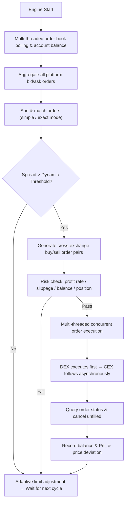

# 🔀 Crypto Cross-Exchange Arbitrage Engine

> **Automated Cross-Exchange Arbitrage System** — Captures price discrepancies across CEX and DEX exchanges, supporting spot arbitrage, futures-spot hedging, and on-chain DEX arbitrage.

[🇨🇳 中文](README.md)

---

## 📌 Overview

This is a **fully automated cryptocurrency cross-exchange arbitrage engine**. It discovers price differences across multiple exchanges in real-time and automatically executes buy/sell orders to capture spread profits. Supports both CEX (Binance, OKX, Bitfinex, Huobi, etc.) and DEX (Uniswap), covering three major strategies: **spot cross-exchange arbitrage**, **futures-spot hedging arbitrage**, and **DEX on-chain arbitrage**.

---

## 💎 Core Competitive Advantages

> What sets this system apart from open-source alternatives like Hummingbot and Blackbird:

### 1. Adaptive Price Limit Engine

Unlike bots with fixed thresholds, this system features a **three-strategy dynamic price limit engine** (`ChangeLimit`) that automatically adjusts trigger thresholds between platforms based on market conditions:

- **Chase-High Strategy** — When a sudden large spread appears, automatically raises the price limit to capture it, with intelligent rollback after 20 minutes
- **Gradual Lowering Strategy** — When persistent small spreads fail to reach the threshold, progressively lowers the limit to prevent idle capital
- **Shortage-Reversal Strategy** — When a platform runs out of inventory, automatically sets the reverse limit to a negative value, enabling continued arbitrage through price deviation

All threshold adjustments are **hot-reloaded at runtime** — no engine restart required. Configuration is persisted to XML.

### 2. Futures-Spot Hybrid Arbitrage

Not limited to spot arbitrage — supports **hedging between futures and spot markets**:

- Supports both coin-margined and USDT-margined contracts
- Automatically detects long/short direction, intelligently handles opening, closing, and position reversal
- Position control via `positionRate` parameter to cap maximum leverage exposure
- When price discrepancies arise between spot and futures, automatically operates on both sides to lock in profit

### 3. DEX Gas Price Dynamic Optimization

For Uniswap and similar DEX on-chain trading, implements sophisticated gas optimization:

- Real-time on-chain gas price querying with dynamic bid adjustment
- Supports optimistic / neutral / pessimistic gas strategies (configurable coefficients)
- Accurately factors miner fees into profit calculation (`fixFee`), ensuring profitability after gas costs
- Automatically selects optimal Uniswap V3 fee tier pools (100 / 500 / 3000 / 10000 bps)
- DEX-CEX async execution strategy: DEX executes first; on success, CEX follows indirectly through balance rebalancing — reducing miss rate

### 4. Self-Healing Engine for Unattended Operation

- After abnormal exit, automatically waits for a configurable duration, then rebuilds and retries
- Engine instance is destroyed and recreated every 24 hours to prevent memory leaks and state accumulation
- `EngineThread` daemon thread continuously monitors, ensuring 24/7 uninterrupted operation

### 5. Price Deviation Trend Analysis

- Records each platform's price deviation from the cross-platform average every minute, stored in SQLite
- Generates multi-platform deviation trend charts to assist in identifying arbitrage timing and pricing anomalies
- Supports customizable time granularity and display range

---

## ⚡ Key Capabilities

- 🔄 **Real-Time Multi-Exchange Spread Detection** — Monitors order books across multiple exchanges simultaneously
- ⚡ **High-Concurrency Matching Engine** — Multi-threaded architecture based on `ThreadPoolExecutor` + `CompletableFuture`, parallel query and execution across exchanges
- 🏦 **CEX + DEX Hybrid Arbitrage** — Supports both centralized and decentralized exchanges, including on-chain DEX like Uniswap
- 📊 **Two Matching Modes** — Simple matching (simple) and exhaustive matching (exact), the latter explores all platform combinations for optimal spreads
- 💰 **Dual Profit Modes** — Configurable "earn coin" or "earn fiat" mode, each with its own balance strategy
- 🔀 **Smart Order Merging** — Automatically merges multiple small orders into larger ones, reducing API calls and improving fill rates
- 📡 **Real-Time Log Streaming** — Pushes trading logs and spread data to the web frontend via WebSocket
- 🛡️ **Risk Control** — Built-in minimum profit rate, minimum trade size, slippage control, position cap, and multiple risk management strategies

---

## 🏗️ Tech Stack

### Backend Framework

| Technology | Version | Purpose |
|------|------|------|
| **Java** | 1.8 | Programming Language |
| **Spring Boot** | 2.4.5 | Application Framework |
| **Spring MVC** | — | Web Layer |
| **Spring WebSocket** | — | Real-Time Communication (STOMP) |
| **Thymeleaf** | — | Server-Side Template Engine |
| **MyBatis-Plus** | 3.4.3 | ORM Persistence |
| **SQLite** | — | Lightweight Embedded Database (price deviation data) |
| **Hprose** | 2.0.38 | Cross-Language RPC (Python/JS strategy modules) |
| **Fastjson** | 2.0.24 | JSON Serialization |
| **Swagger / Springfox** | 3.0.0 | API Documentation |
| **Lombok** | 1.18.26 | Code Simplification |
| **Apache HttpClient** | 4.5.12 | HTTP Client |
| **Logback** | — | Logging Framework (with WebSocket real-time push) |
| **dom4j** | 1.6.1 | XML Configuration Parsing (runtime hot-reload) |

### Build & Deployment

| Tool | Description |
|------|------|
| **Maven** | Build & Dependency Management |
| **Multi-Environment Profiles** | dev / test / prd configurations |
| **Maven Profiles** | Environment activation via `@env@` placeholder |

---

## 📂 Project Structure

```
src/main/java/com/liujun/trade_ff/
├── core/                    # 🔥 Core Arbitrage Engine
│   ├── Engine.java          # Main engine entry (1200+ lines), orchestrates all operations
│   ├── Trade.java           # Abstract base class for exchange adapters (polymorphic design)
│   ├── ChangeLimit.java     # Adaptive price limit engine (3 strategies, hot-reload)
│   ├── VirtualTrade.java    # Virtual platform (for internal hedging simulation)
│   ├── EngineThread.java    # Engine daemon thread (self-healing, auto-restart)
│   ├── Prop.java            # Global configuration properties
│   ├── binance/             # Binance spot adapter (full API SDK)
│   ├── binanceF/            # Binance Futures adapter (coin/USDT-margined, auto long/short)
│   ├── okcoin/              # OKX spot adapter
│   ├── okcoinF/             # OKX futures adapter
│   ├── bitfinex/            # Bitfinex adapter
│   ├── huobi/               # Huobi adapter
│   ├── uniswap/             # Uniswap DEX adapter (gas optimization, fee tier selection)
│   ├── poloniex/            # Poloniex adapter
│   ├── modle/               # Domain models (MarketDepth, Order, Balance, PriceInfo, etc.)
│   ├── thread/              # Background threads (price deviation tracking, avg price)
│   └── util/                # Utilities (HTTP, signing, XML config parsing, etc.)
├── controller/              # Web Controllers (engine start/stop, deviation queries)
├── config/                  # Configuration (WebSocket, MVC, Servlet)
├── common/                  # Filters, interceptors, exception handling, WebSocket log output
├── service/                 # Business service layer
├── dao/                     # Data access layer (MyBatis Mappers)
├── model/                   # Database entities
└── utils/                   # Common utilities
```

---

## ⚙️ Core Workflow



---

## 🔑 Supported Exchanges

| Exchange | Type | Adapter | Highlights |
|--------|------|--------|------------|
| Binance | CEX Spot | `Trade_binance.java` | Full API SDK, auto fee adjustment |
| Binance Futures | CEX Futures | `Trade_binanceF.java` | Coin/USDT-margined, auto long/short detection |
| OKX (OKCoin) | CEX Spot/Futures | `Trade_okcoin.java` | Dual spot/futures mode |
| Bitfinex | CEX Spot | `Trade_bitfinex.java` | HMAC signature authentication |
| Huobi | CEX Spot | `Trade_huobi.java` | — |
| Uniswap | DEX | `Trade_uniswap.java` | Dynamic gas optimization, V3 fee tier selection |
| Poloniex | CEX Spot | `Trade_poloniex.java` | — |

> **Extensible Architecture**: Implement 5 methods from the abstract `Trade` base class (`flushMarketDeeps`, `flushAccountInfo`, `tradeOrder`, `queryOrderState`, `cancelOrder`) to quickly integrate new exchanges.

---

## 📡 Web Monitoring Dashboard

The system provides a web interface with real-time updates via WebSocket (STOMP protocol):

- **Engine Control** — One-click start / stop the arbitrage engine
- **Real-Time Logs** — Trade execution, spread data, and balance changes pushed to the page
- **Deviation Chart** — Cross-platform price deviation curves with customizable time granularity
- **P&L Statistics** — Cumulative P&L, period P&L, per-exchange asset breakdown
- **Manual Tuning** — Adjust price deviation and limit thresholds at runtime

Endpoint: `/webchat` (with SockJS fallback)

---

## 🚀 Deployment Guide

### Prerequisites

- **JDK** 1.8+
- **SQLite** 3
- **Maven** 3.x
- Linux server (recommended)

### Installation Steps

1. **Install Java 8 and SQLite 3**
   ```bash
   sudo apt install openjdk-8-jdk sqlite3
   ```

2. **Create log and database directory**
   Create the directory based on the `log.path` value in `application.yml`. This directory also stores the SQLite database.

3. **Modify production configuration**
   Edit `application-prd.yml`, place `conf.xml` in the log directory and update `firstBalance` and other parameters.

4. **Maven build**
   ```bash
   mvn clean package -P prd
   ```

5. **Initialize database**
   Run `createTable.sql` to create tables and insert initial data.

6. **DEX Authorization** (if using Uniswap)
   Authorize the contract to spend your tokens.

7. **Start the application**
   ```bash
   java -jar target/trade_ff-0.0.1-SNAPSHOT.jar
   ```

---

## 📄 License

This project is for learning and research purposes only. Cryptocurrency trading involves risk — proceed with caution.
